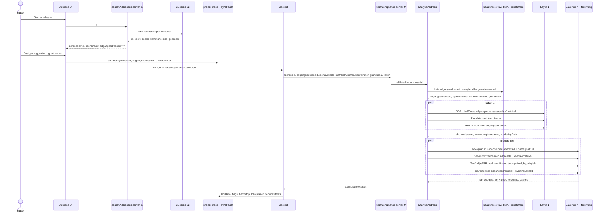

# Adresseflow: fra indtastet adresse til cockpit-data

Denne side viser den faktiske kald-række, når en bruger vælger en adresse og
lander i cockpittet. Fokus er på hvilke id'er der sendes videre, og hvor de
kommer fra.

## De vigtigste id'er

| Felt | Betydning | Første kilde i flowet | Bruges til |
| --- | --- | --- | --- |
| `addressId` / `adresseid` | DAR adresse-id, typisk den konkrete adresse/enhed | GSearch `id` | Cache-nøgle, DAR enrichment, servitutter, lokalplan-cache |
| `adgangsadresseid` | DAR husnummer-id | `DAR_Adresse.husnummer` | BBR, EBR/VUR, Tjekditnet |
| `ejerlavskode` | Numerisk ejerlavskode | `MAT_Ejerlav.ejerlavskode` via DAR/MAT | MAT grundareal, Tingbogen |
| `matrikelnummer` | Matrikelnummer | `MAT_Jordstykke.matrikelnummer` via DAR/MAT | MAT grundareal, Tingbogen |
| `jordstykke_lokal_id` | MAT jordstykke UUID | `MAT_Jordstykke.id_lokalId` | MAT WFS parcelpolygon, GeoDanmark-filter |
| `bygning_lokal_id` / `alle_bygning_lokal_ids` | BBR bygning UUID'er | `BBR_Bygning.id_lokalId` | FBB SAVE/fredning, EMOData |
| `bfeNr` | Bestemt fast ejendom | EBR `bestemtFastEjendomBFENr` | VUR vurdering, MAT fallback-ruter |
| `koordinater` | WGS84 lat/lng | GSearch geometri, konverteret fra UTM32 | Plandata, DAI, DK-Jord, GEUS, DHM, fjernvarme |

Vigtigt: autocomplete-flowet sætter lige nu `adgangsadresseid` til tom streng i
GSearch-resultatet. Det bliver først udfyldt server-side i DAR enrichment via
`DAR_Adresse.husnummer`.

## Overblik

## Detaljeret kald-række

| # | Hvornår | Kald / service | Input | Input kommer fra | Output der sendes videre |
| --- | --- | --- | --- | --- | --- |
| 1 | Autocomplete | Dataforsyningen GSearch v2 `GET /adresse` | `q`, `limit`, evt. token | Brugerens tekst | `adresseid`, adressetekst, postnr, kommunekode, geometri |
| 2 | Adresse valgt | Lokal `project-store` + `syncPatch` | Valgt suggestion | GSearch-resultat | `address` gemmes; `adgangsadresseid` er tom i nuværende mapping |
| 3 | Cockpit starter analyse | `fetchCompliance` | `addressId`, `adgangsadresseid`, `ejerlavskode`, `matrikelnummer`, `koordinater`, `grundareal`, `projectId`, token | `project-store` | Validated server input |
| 4 | Address enrichment | Datafordeler DAR GraphQL `DAR_Adresse` | `id_lokalId = addressId` | GSearch `adresseid` | `husnummer` FK = `adgangsadresseid` |
| 5 | Address enrichment | Datafordeler DAR GraphQL `DAR_Husnummer` | `id_lokalId = husnummerFK` | `DAR_Adresse.husnummer` | `jordstykke` FK |
| 6 | Address enrichment | Datafordeler MAT GraphQL `MAT_Jordstykke` | `id_lokalId = jordstykkeFK` | `DAR_Husnummer.jordstykke` | `matrikelnummer`, `ejerlavLokalId`, `registreretAreal` |
| 7 | Address enrichment | Datafordeler MAT GraphQL `MAT_Ejerlav` | `id_lokalId = ejerlavLokalId` | `MAT_Jordstykke.ejerlavLokalId` | `ejerlavskode` |
| 8a | Layer 1, parallel | Datafordeler MAT GraphQL `MAT_Ejerlav` | `ejerlavskode` | DAR/MAT enrichment | `ejerlavLokalId` |
| 8b | Layer 1, parallel | Datafordeler MAT GraphQL `MAT_Jordstykke` | `ejerlavLokalId + matrikelnummer` | 8a + enrichment | `registreretAreal`, beskyttelseslinjer, `jordstykkeLokalId` |
| 8c | Layer 1, fallback | `GrundarealResolver`: EBR -> MAT SFE/Ejerlejlighed | `adgangsadresseid`, `addressId` | DAR enrichment + GSearch | Grundareal og jordstykker hvis ejerlav/matrikel mangler |
| 9 | Layer 1 | Datafordeler BBR GraphQL `BBR_Bygning` | `husnummer = adgangsadresseid`, plus `grundareal` til beregning | DAR enrichment + MAT | BBR summary, fredning, bygning UUID'er |
| 10a | Layer 1, parallel | Plandata WFS lokalplan | `POINT(lng lat)` | GSearch koordinater | Lokalplaner + primær PDF-kandidat |
| 10b | Layer 1, parallel | Plandata WFS kommuneplanramme | `POINT(lng lat)` | GSearch koordinater | Kommuneplanramme |
| 11a | Layer 1, parallel | Datafordeler EBR GraphQL | `husnummerLokalId = adgangsadresseid` | DAR enrichment | `bfeNr` |
| 11b | Layer 1, parallel | Datafordeler VUR GraphQL | `BFEnummer -> recordId -> propertyId` | EBR `bfeNr` | Nyeste vurderingsdata |
| 12 | Layer 2 | Supabase cache / AI PDF extractor | `addressId`, `primaryPdfUrl` | GSearch + Plandata | Lokalplanudtræk |
| 13 | Layer 3 | Supabase cache / TingbogenV2 mock/live | `addressId`, `ejerlavskode`, `matrikelnummer` | GSearch + enrichment | Servitutter |
| 14 | Layer 4 først | Datafordeler MAT WFS | `jordstykke_lokal_id` | Layer 1 MAT/BBR merge | Parcelpolygon, areal, centroid, bbox |
| 15 | Layer 4 før skip-gate | FBB WFS | `ois_id IN (BBR bygning UUID'er)` | BBR `alle_bygning_lokal_ids` | SAVE-værdi og FBB-fredning |
| 16 | Layer 4 evt. skip | Hard-stop gate | `fredet`, MAT strand/fredskov/klit | BBR + MAT | Springer dyre geokald over ved absolut stop |
| 17 | Layer 4, parallel | DAI Naturbeskyttelse WFS | `POINT(lng lat)` | GSearch koordinater | Naturbeskyttelseslinjer |
| 18 | Layer 4, parallel | DK-Jord WFS | Parcelpolygon eller `POINT(lng lat)` | MAT WFS cache eller GSearch | Jordforurening, olietank, områdeklassificering |
| 19 | Layer 4, parallel | GEUS WFS | 500 m bbox omkring koordinat | GSearch koordinater | Grundvand/geoteknik |
| 20 | Layer 4, parallel | Datafordeler DHM WCS | UTM32 bbox fra koordinat + grundareal | GSearch + MAT | Terrændata |
| 21 | Layer 4, parallel | GeoDanmark WFS | Parcel bbox eller fallback bbox, evt. eget `jordstykkeId` | MAT WFS + GSearch | Nabobygninger/vejadgang |
| 22 | Layer 4, parallel | Plandata fjernvarme WFS | `POINT(lng lat)` | GSearch koordinater | Fjernvarmedækning |
| 23 | Layer 4, parallel | Plandata udvidet WFS | Parcelpolygon eller punkt | MAT WFS cache + GSearch | Zone, delområde, byggefelt, kloakopland |
| 24 | Layer 4, parallel | DAI Arealdata WFS | Parcelpolygon eller punkt | MAT WFS cache + GSearch | §3, Natura 2000, diger, fortidsminder m.m. |
| 25 | Forsyning, parallel | Supabase `broadband_coverage` | `adgangsadresseid` | DAR enrichment | Tjekditnet bredbåndsdækning |
| 26 | Forsyning, parallel | EMOData SOAP | `bbrBygningId` | BBR canonical building UUID | Energimærke, hvis credentials findes |

## Kilder i koden

- Adressevalg og første persistence: `src/routes/projekt.adresse.tsx`
- GSearch mapping: `src/integrations/gsearch/client.ts`
- Cockpit input til server: `src/hooks/useCockpitAnalysis.ts`
- Thin server function: `src/lib/cockpit.functions.ts`
- Orchestrering: `src/lib/analysis-orchestrator.ts`
- DAR enrichment: `src/lib/analysis/address-enrichment.ts` og `src/integrations/dar/client.ts`
- Layer 1: `src/lib/analysis/layer1-analysis.ts` og `src/lib/compliance-layer1.ts`
- Layer 4: `src/lib/analysis/geo-risk-step.ts`

## Note om mulig forvirringskilde

Der er et dataskel mellem browserens `address` og serverens berigede adresse:

- Browseren gemmer address fra GSearch, hvor `adgangsadresseid` er `""`.
- Serveren finder korrekt `adgangsadresseid` i DAR enrichment.
- Den berigede `adgangsadresseid` bliver brugt til BBR/EBR/VUR/Tjekditnet i samme analyse.
- Jeg kan ikke se, at den berigede `adgangsadresseid` bliver skrevet tilbage til
  `project-store.address` i dette flow. Derfor kan UI/debugfelter stadig vise tomt
  `ADGANGSADRESSEID`, selvom serveranalysen har brugt det korrekt.
